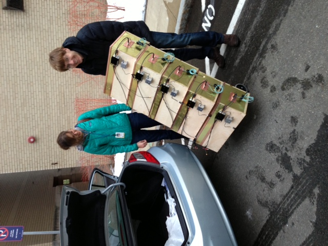
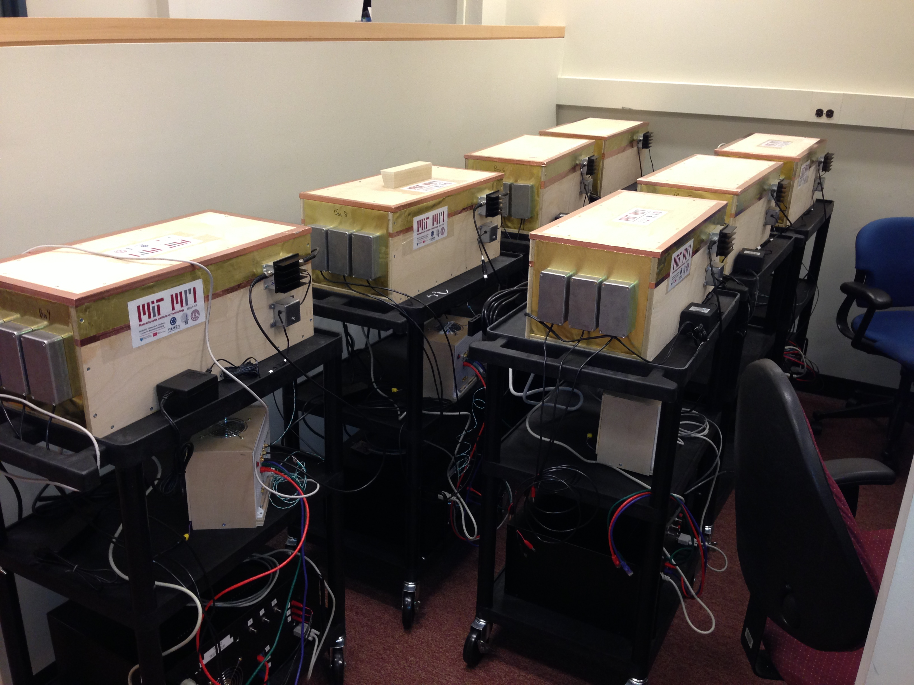
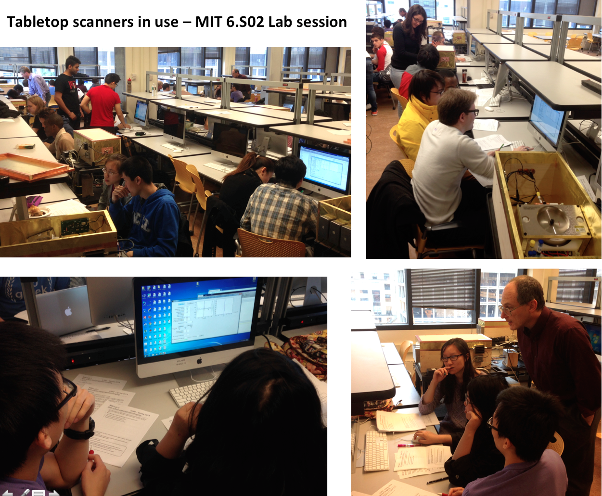
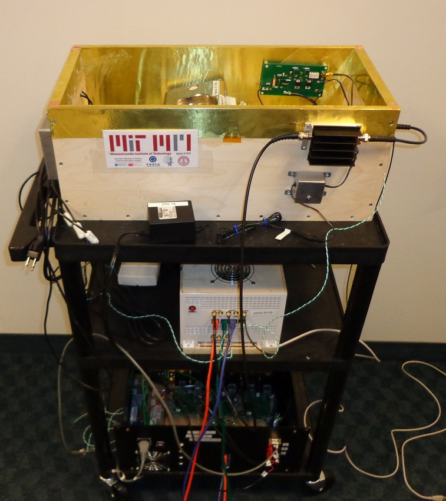

This Wiki is a resource for people who are assembling, programming, or
using the instructional tabletop MRI scanner developed by a
multi-institutional collaboration led by [Larry Wald's
group](http://www.nmr.mgh.harvard.edu/martinos/people/showPerson.php?people_id=178)
at the [Martinos Center for Biomedical
Imaging](http://www.nmr.mgh.harvard.edu/martinos/flashHome.php),
[Massachusetts General Hospital](http://www.massgeneral.org/).

The scanner design is a low-cost resource for demonstrating concepts
like magnetic resonance, spatial encoding, and the Fourier transform in
an educational setting. The system was first used in MIT's undergraduate
course [6.S02 - Intro to EECS II from a Medical Technology
Perspective](http://www.eecs.mit.edu/academics-admissions/academic-information/subject-updates-st-2013/6s02).
Most of the components are open source designs.

The project was made possible through a collaboration between MGH, the
Chinese Academy of Sciences (who built the magnets), Pascal Stang of
Stanford University (who provided the MEDUSA console), and Maxim
Zaitsev's group at the University of Freiburg (who designed the gradient
coil traces). During fabrication we also benefited from access to the
equipment and resources of the [Center for Bits and
Atoms](http://cba.mit.edu/) at the [MIT Media
Lab](http://media.mit.edu/).

The scanner design is described in a JMR paper
1 *(download link pending from the responsible PI or project owner)*
and also [an abstract from the 2014 ISMRM
conference](http://archive.ismrm.org/2014/4819.html).

First delivery to MIT:
 Systems ready to roll out:
 Students and faculty using the
scanners in MIT 6.S02:

The ISMRM 2014 slides describing the tabletop scanner require a current
PI-managed external download link.

## Introduction

Other low-cost tabletop imaging systems:

[Desktop MRI system with 2 cm
bore](http://www.ncbi.nlm.nih.gov/pubmed/11755094) from [Steve Wright's
lab](http://www.ece.tamu.edu/~mrsl/wright_ee_dept_bio.html) at [Texas
A&M](http://www.tamu.edu/).

The Open Source Mobile MR Relaxometer material from [Mark Griswold's
lab](http://ccir.case.edu/People/MarkAlanGriswoldPhD) at [Case
Western](http://www.case.edu/) requires a current owner-managed external
download link.

[Terranova-MRI earth's field system from
Magritek.](http://www.magritek.com/products-terranova-overview)

[MRIjx table top teaching system](http://www.ebresearch.net/) from
Niumag in [Shanghai](http://en.wikipedia.org/wiki/Shanghai).

[Pure Devices 0.5T tabletop system](http://pure-devices.com/) from
[Würzburg, Germany](http://en.wikipedia.org/wiki/Wurzburg).

## Hardware

- [Console](/tabletop-mri/console/)
- [Gradient coil](/tabletop-mri/gradient-coil/)
- [GPA/Gradient Filters](/tabletop-mri/gpa/)
- [Magnet](/tabletop-mri/magnet/)
- [RF](/tabletop-mri/rf/)
- Other 3D-printed components *(external download link pending)*
- Parts list *(external download link pending)*

## Sequences

- [GUI Source Code, Descriptions, and Screen shots](/tabletop-mri/source-code/)

## Images

- [Images](/tabletop-mri/images/)

## Lab Manuals + Course Notes

**2015 Class**

- Lab 1 *(external download link pending)*
- Lab 2 *(external download link pending)*
- Lab 3 *(external download link pending)*

**2013 Class**

- Pre-Lab 1 *(external download link pending)*
- Lab 1 *(external download link pending)*
- Pre-Lab 2 *(external download link pending)*
- Lab 2 *(external download link pending)*
- Pre-Lab 3 *(external download link pending)*
- Lab 3 *(external download link pending)*

## Contributors

This "crowd-sourced" MRI scanner has benefited from the skills and
efforts of many people. We wish to acknowledge some of the key
contributors below:

**Overall project leadership**: Lawrence Wald (MGH)

**Lab documents and instructions**: Lawrence Wald, Clarissa Cooley, and
Elfar Adalsteinsson (MGH)

**Advisors on technical and educational content**: Elfar Adalsteinsson
and Jacob White (MIT)

**RF subsystem lead**: Clarissa Cooley (MGH)

**RF coil design/assembly**: Azma Mareyam, Clarissa Cooley, and Cris
LaPierre (MGH)

**Gradient power amplifier design**: V1: Thomas Witzel (MGH); V2: Nick
Arango, Jacob White, Jason Stockmann, and Charlotte Sappo (MGH and MIT)

**GUI software and sequences curator**: Jason Stockmann (MGH)

**Gradient wire pattern design**: Feng Jia and Maxim Zaitsev (Freiburg)

**Gradient coil fabrication and system mechanical integration**: Cris
LaPierre (MGH)

**MEDUSA Console**: Pascal Stang and Greig Scott (Stanford & Procyon
Research)

**Magnet design and construction**: Yang Wenhui and Wang Zheng (Chinese
Academy of Science - Beijing)

**Projection reconstruction GUI**: Erica Mason, Jason Stockmann, and
ByungKun Lee (MGH and MIT)

**HASTE spin echo train sequence**: Jason Stockmann and Bo Zhu (MGH)

**Slice-select GUI** (work-in-progress): Melissa Haskell (MGH)

## References

Consult the [User's Guide](http://meta.wikimedia.org/wiki/Help:Contents)
for information on using the wiki software.

## Getting started

- [Configuration settings
  list](http://www.mediawiki.org/wiki/Manual:Configuration_settings)
- [MediaWiki FAQ](http://www.mediawiki.org/wiki/Manual:FAQ)
- [MediaWiki release mailing
  list](https://lists.wikimedia.org/mailman/listinfo/mediawiki-announce)
