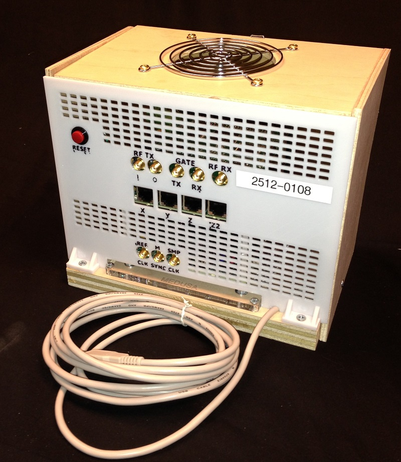

## Console

The scanner uses the "Medusa" console developed by the Stanford EE
department (by Grieg Scott and Pascal Stang). The console interfaces
with the computer via MATLAB. It produces the RF transmit pulses and
gradient waveforms based on vectors created in a MATLAB pulse sequence
script. It also acquires the received MRI signal at a time specified in
the sequence. The console samples the received signal and downconverts
it to baseband. Some specifics are at:
<http://mrsrl.stanford.edu/~medusa/hardware/>

The journal article describing the console requires a current PI-managed
external download link.

An overview of the MEDUSA Matlab pulse sequence programming format is
described
here *(download link pending from the responsible PI or project owner)*.

