**Gradient Power Amplifier**

------------------------------------------------------------------------

The gradient amplifier is used to supply the current to the gradient
coils. Since it's the fields we care about, and the fields are
proportional to current, this amplifier can be viewed as a voltage to
current transducer; it takes a voltage waveform from the console and
creates a current proportional to that voltage in the gradient coil. It
is similar to a common audio power amplifier except that it must also be
able to output DC currents. It uses two [OPA
549](http://www.ti.com/lit/ds/symlink/opa549.pdf) power op-amps in a
bridged configuration. A current sensor compares the output current to
the input voltage to ensure that the current itself is proportional to
the desired signal. The OPA549s can provide up to 8 amps of current, but
in practice the current is limited by the duty cycle of the gradient
waveform in the pulse sequence and the size of the heat sink used on the
boards.

Two versions of the board have been used with the tabletop scanner.
[Version 1](/tabletop-mri/gpa/#version-1-of-the-gpa-board) uses separate digital-to-analog
converter (DAC) boards and provides one output channel per GPA board.
[Version 2](/tabletop-mri/gpa/#version-2-of-the-gpa-board) simplified the wiring and reduced costs
by placing three channels with integrated DAC stages onto a single PCB.
Version 2 is plug-and-play compatible with the MEDUSA console digital
gradient waveform output lines (RJ45 connector).

Email <jaystock@nmr.mgh.harvard.edu> with any questions.

## Version 1 of the GPA board

A summing point op amp is used to compare the current sense resistor
voltage to the input signal in order to adjust the output stage as
needed. The current sensor consists of an
[INA105](http://www.ti.com/lit/ds/symlink/ina105.pdf) differential
amplifier that measures the voltage across a small (0.1 ohm) resistor in
series with the output. A differential amplifier on the INA105 output
provides a differential signal that can be scoped to monitor the current
sense resistor voltage.

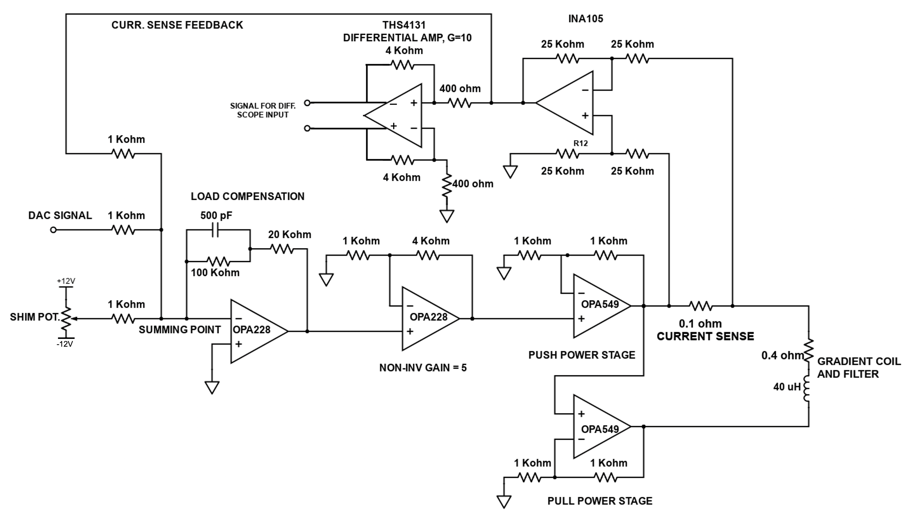

Click
here *(download link pending from the responsible PI or project owner)* to
view the schematic for the GPA boards generated in Eagle (version 6).
Note that a separate A/D converter was used in the initial realization
of the boards (DAC on the GPAs was not populated).

Click
here *(download link pending from the responsible PI or project owner)* to
download Eagle version 6 board (.brd) and schematic (.sch) files for the
V3 GPA board (does not include on-board DAC).

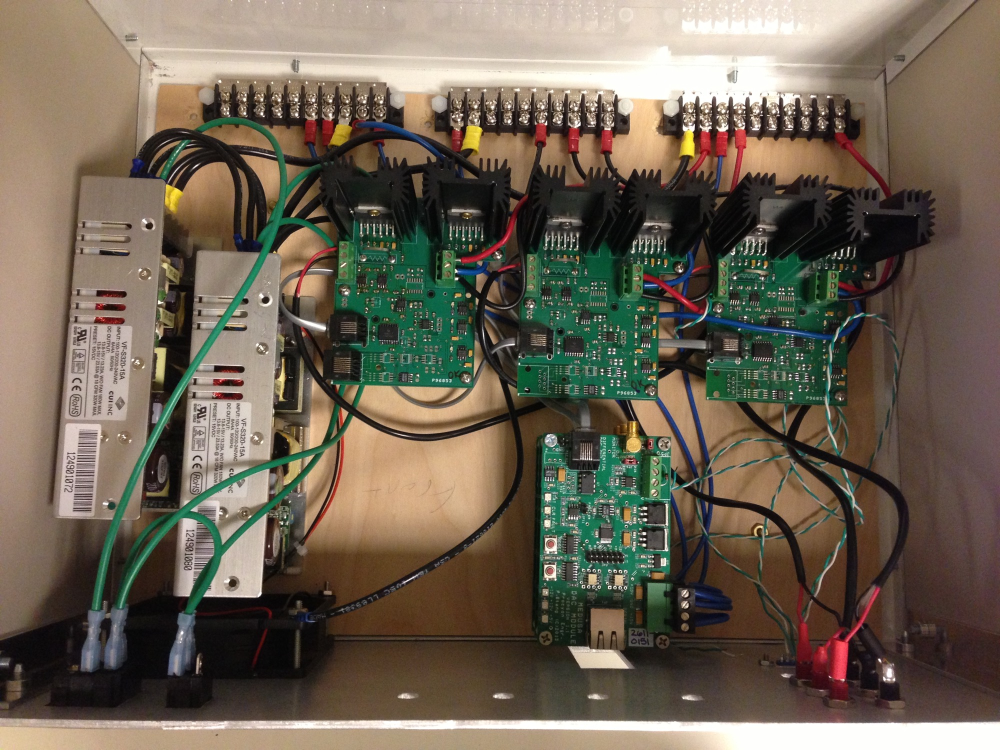

The boards were run on bipolar +15 V and -15 V rails provided by CUI
switching supplies. On-board regulators provide +12 V, -12 V, and +5 V for
powering the small ICs. The +12 V fan is powered by a small JST connector on
the CUI supplies.

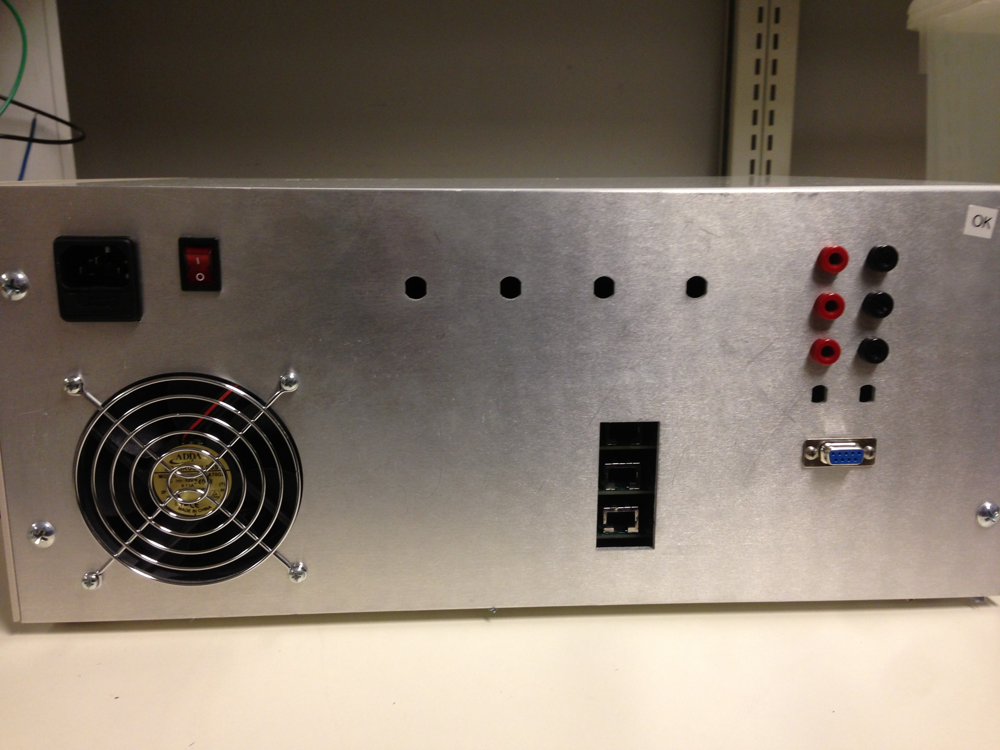

The aluminum front panels were made using a water-jet cutter and
[Hammond NHC-14157 enclosures](http://www.mouser.com/ProductDetail/Bud-Industries/NHC-14157/?qs=W%252bB5Pl59bv4hUDQy1Kr8cw==)
were used to house the GPAs and DACs. The DXF download requires a current
PI-managed external link. Version 2 of the GPA board requires a horizontal
slot for the RJ45 connectors instead of the vertical slot used here.

## Version 2 of the GPA board

Version 2 of the board differs from Version 1 in the following ways:

1.  ) slightly simplified analog stage
2.  ) on-board DACs
3.  ) integration of three channels onto a single PCB.

The analog stage still uses two OPA549 power op amps in a push-pull
configuration. But instead of a summing point op amp (as in V1), two
feedback loops are used across the current sense resistor. The circuit
is designed to run on a 14V-to-24V supply rail, with higher rail
voltages providing faster gradient slew rates for a given load
inductance. The circuit specifications and performance are described in
more detail in an ISMRM abstract: [Arango et al., ISMRM 2016, p.
1157](http://cds.ismrm.org/protected/16MPresentations/abstracts/1157.html).
Click
here *(download link pending from the responsible PI or project owner)*
to download slides from the ISMRM talk. The circuit was originally
designed for use as an 8ch open-source, low-cost current driver for
multi-coil shimming and other applications. [Click
here](/rf-lab/current-driver/)
for information about the 8ch board, including software for simulating
the open loop transfer function and step response of the circuit into a
specified load (useful for choosing the load impedance compensation
circuit values).

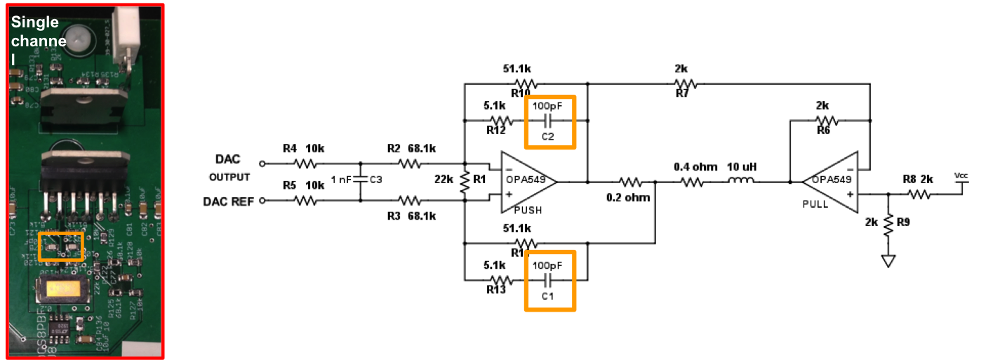

 Click here *(download link pending from the responsible PI or project owner)*
to download Eagle version 6 board (.brd) and schematic
(.sch) files for the GPA board with on-board DACs (Rev B). GERBER files
for board production are also included.

The GPA board has three parallel analog stages, each connected to a DAC.
RJ45 connectors accept the [MEDUSA console](/tabletop-mri/console/)
digital SPI outputs for the X, Y, and Z gradient axes.
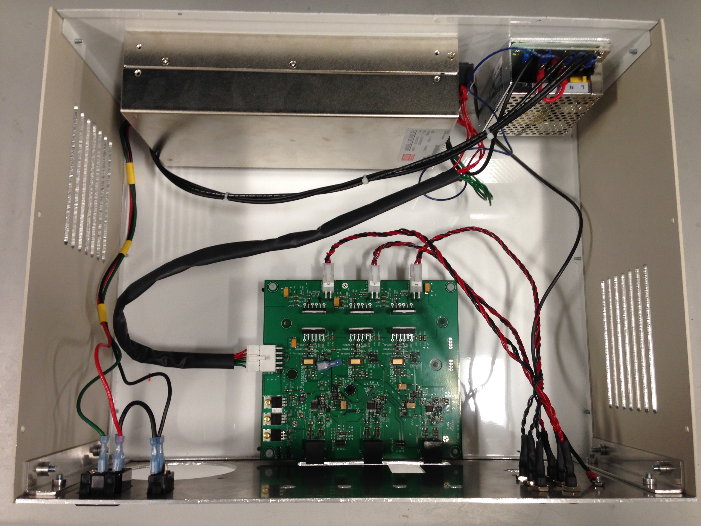

This installation is powered by a 24 V, 25 A switching supply and a small
-15 V supply for the digital-stage ICs. Heat sinks and a fan were not yet
installed when the photo was taken.

*Known bugs in Rev B*: (1.) The LT1920 current sense buffer op amp is
not working and requires debugging. The positive rail of the op amp was
mistakenly connected to the +24V rail instead of the regulated +12V
rail. We recommend using the board without the LT1920 for the time being
until a bug fix is posted. (2.) The stencil for the Avago HCPL-0738
optical isolator showing the location of Pin 1 is incorrect. The stencil
does not correspond to a possible location where Pin 1 can be located.
Instead, the stencil should be lined up with Pin 4 on the IC.

## Gradient Filter

6th order butterworth low pass filters were added to the lines leading
to the gradients.

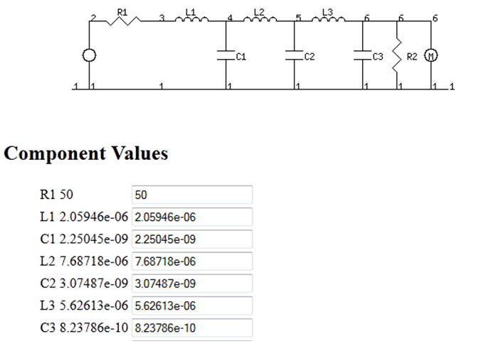

R1 and R2 are not necessary in the final assembly.

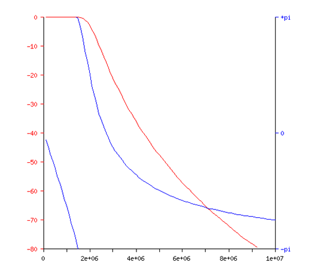

The final version of these files can be downloaded as Eagle
5.11.0 *(download link pending from the responsible PI or project owner)*
and
Gerber *(download link pending from the responsible PI or project owner)*
(for having the boards manufactured).

**Note:** Inductors were selected based on lead time and inductance and
NOT on the package. Any inductor with similar inductance would work. The
board was specifically designed for the following: [2.1
uH](http://www.yuden.co.jp/ut/product/category/inductor/NR10050T2R1N.pdf),
[7.7 uH](http://www.sumida.com/products/pdf/CDEP147.pdf) and [5.6
uH](http://media.digikey.com/PDF/Data%20Sheets/Vishay%20Dale%20PDFs/IHLP-3232DZ-11.pdf).

**Note:** All capacitor pads are for a 1206 package. There are four pads
at each spot to allow for using multiple capacitors to obtain the
specified value.

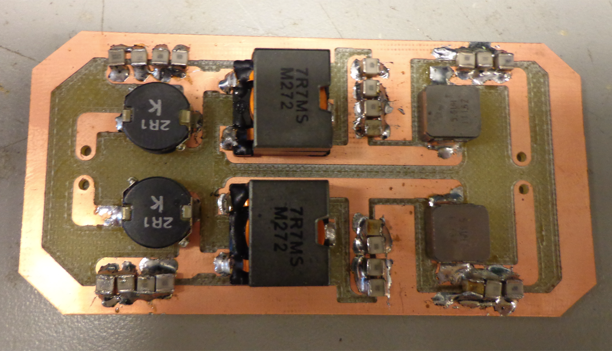

## 3ch GPA using 8ch Shim Board

Using the existing Rev C shim amplifier board, this GPA gives 3 channels
of 8+ Amps of current. Channels X and Z have a gain of 5.5 A/V, and
channel Y has a gain of 3.75 A/V. The GPA is powered with two series 24V
supplies. Three BNC connectors take voltage waveform inputs at audio
frequencies output to three banana plug outputs. An ammeter tracks total
current use for the board, with a typical quiescent current of 600 mA.
There are current sense pins available per channel at 1 V/A.
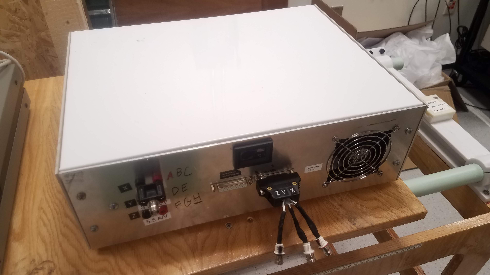

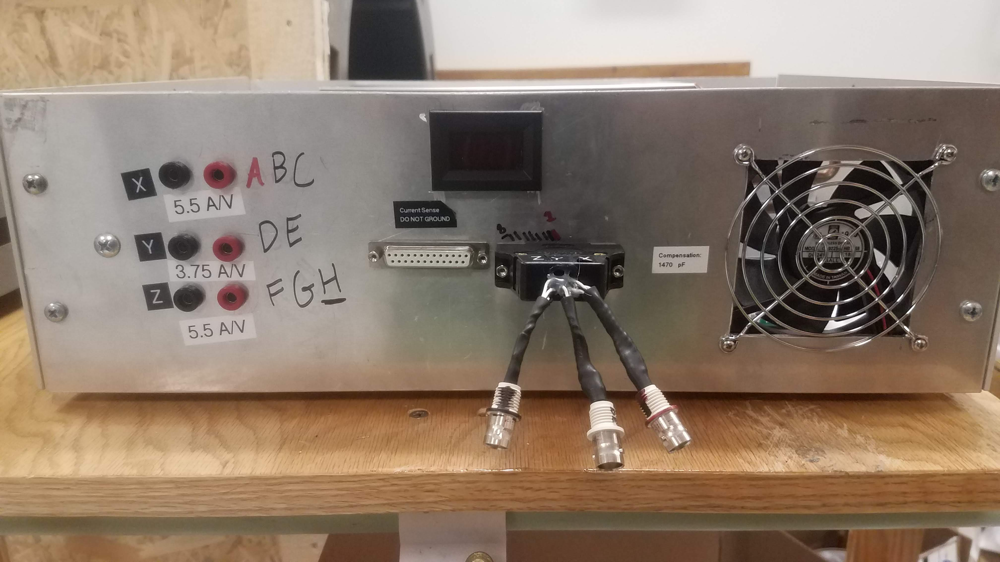

The three BNC ports (X, Y, Z) take differential voltage waveforms and output
more than 8 A through three banana-plug outputs.

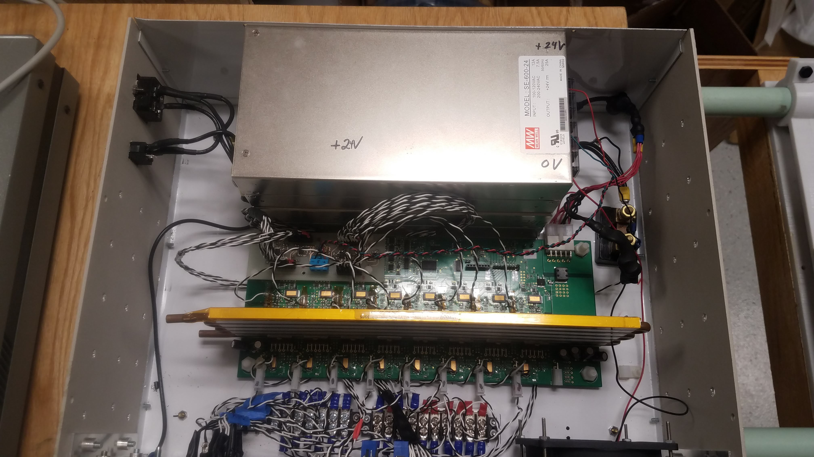

The Rev C shim amplifier board is modified with input and output buffers. Its
channels are grouped to raise current limits: three channels for X and Z and
two for Y.

To use the Rev C shim amplifier board, the GPA groups channels together
(3 for X, Z, 2 for Y) to raise current limits. The shim pcb is fitted
with an additional buffer board that attaches on top of it. The buffer
board buffers the inputs and current sense outputs to avoid grounding
issues. The inputs and outputs to the buffer board are wires that are
jumped onto the board.

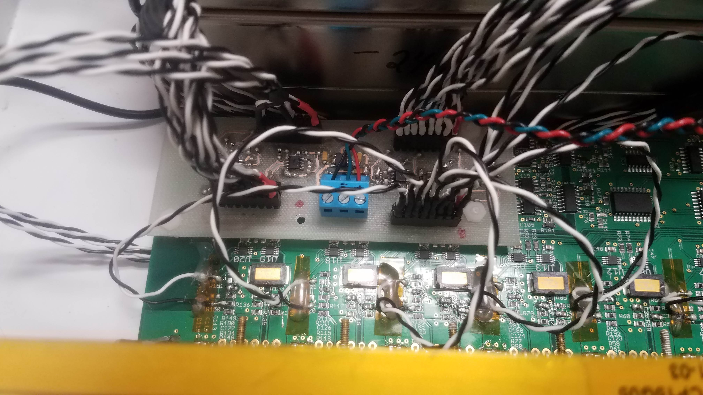

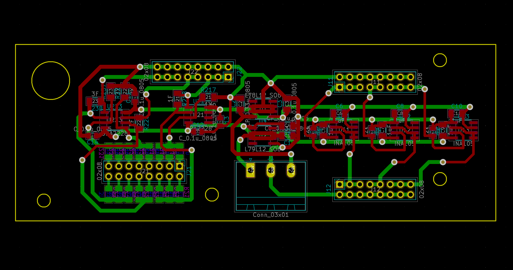

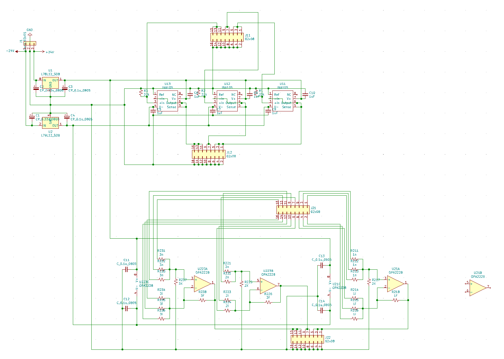

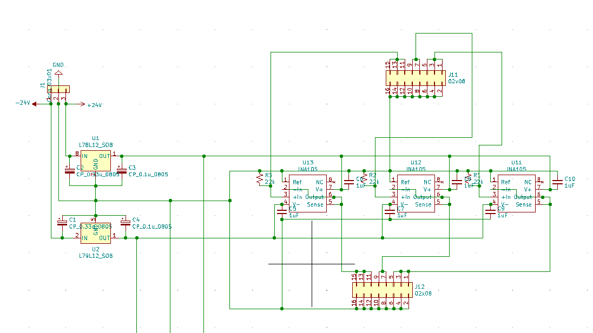

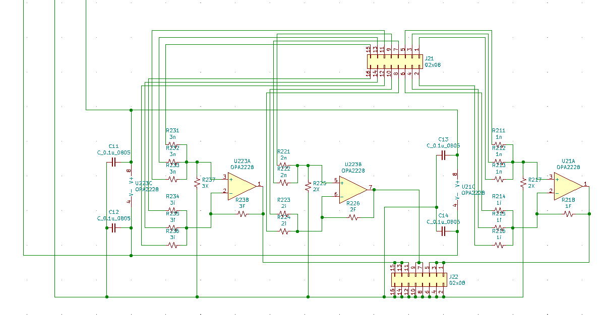

The Rev C shim board requires a tuned compensation feedback loop to
avoid signal ringing. This is dependent on the load -- for the Halbach
scanner, a tabletop MR scanner with ~400 uH coil inductance and ~2 Ohm
resistance, the feedback capacitors are currently 1470 pF. This requires
switching out components to change.

The buffer-board KiCAD files require a current PI-managed external download
link.
