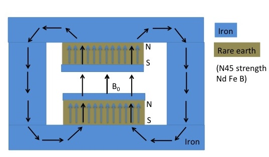
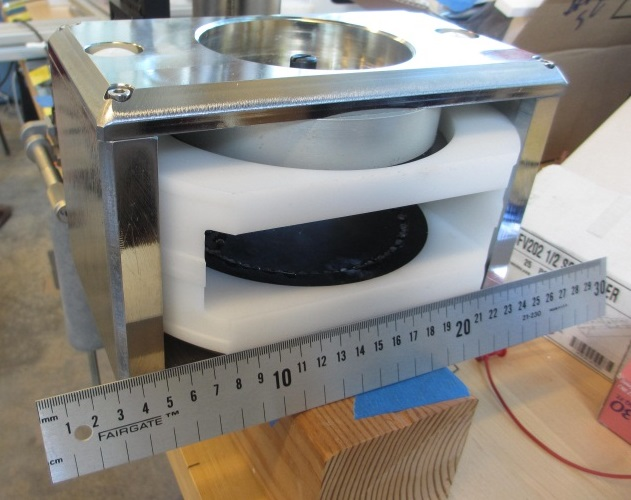
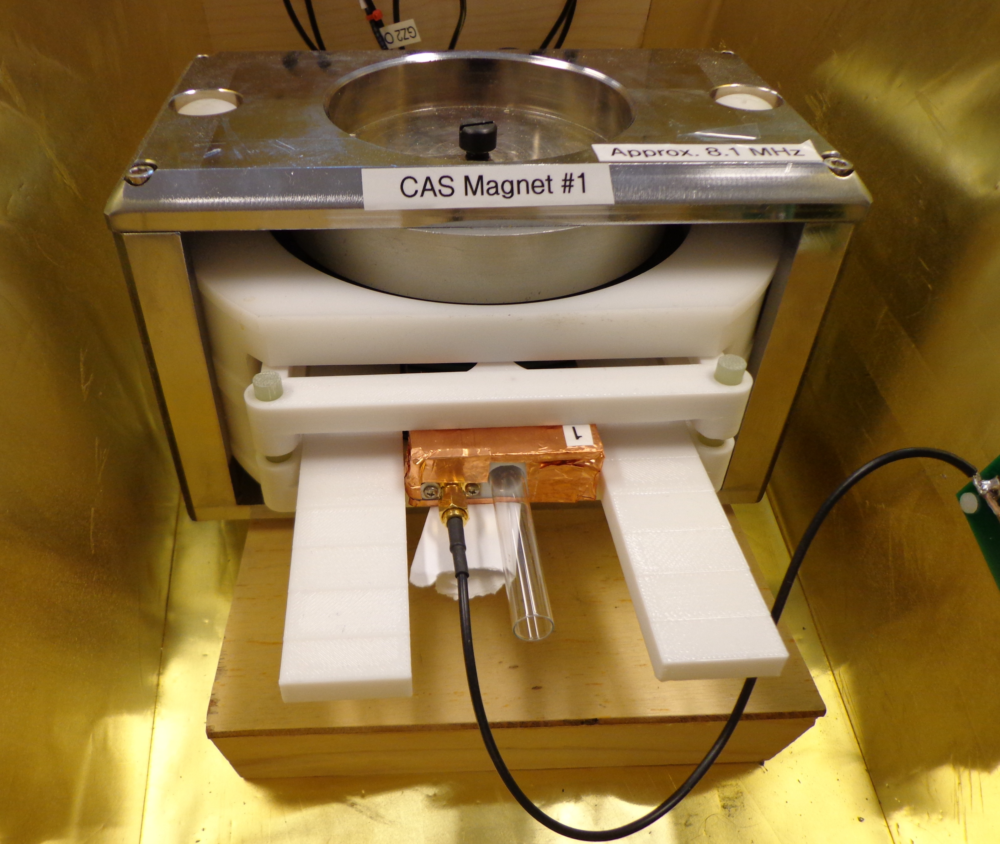
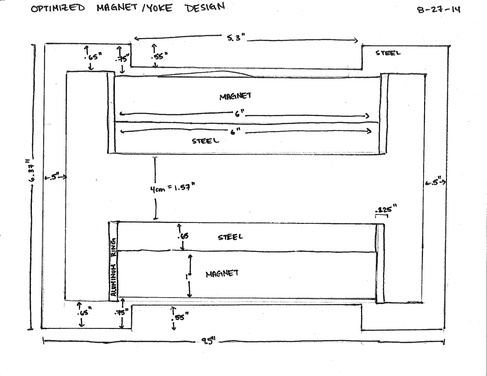
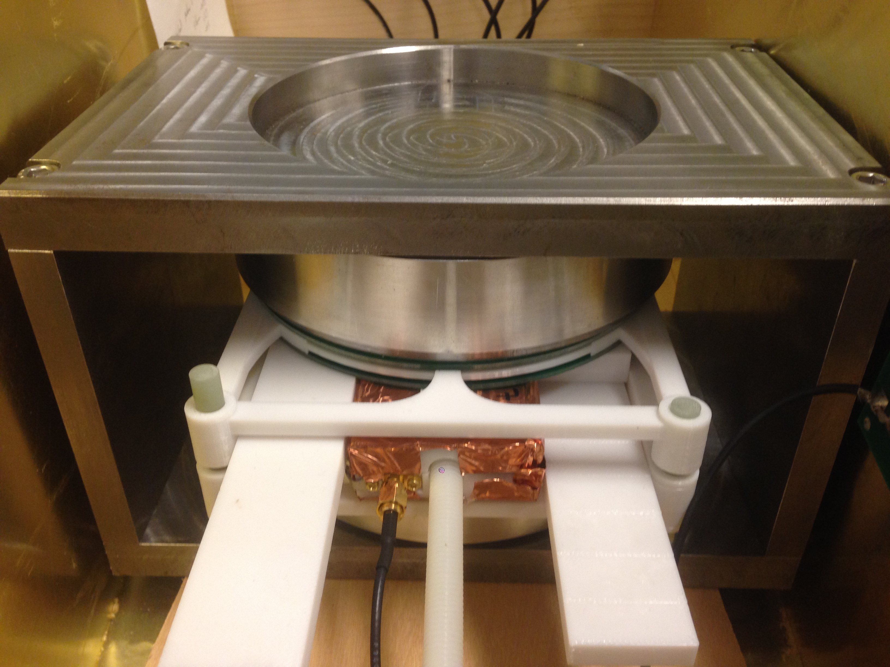

## First Generation Magnet (CAS)

The B0 field is created by a small 0.19T permanent magnet weighing about
13kg. The two N45M (NdFeB) rare-earth magnet disks are 15cm in diameter
and held 4cm apart with an iron yoke, which also provides a flux-return
path for the magnetic field, containing the field to the gap between the
pole pieces (and inside the iron). The magnet was designed and
constructed by the group of Prof. Yang Wenhui of the Institute of
Electrical Engineering of the Chinese Academy of Sciences in Beijing.
Design and construction was supervised by Wang Zheng. The CAS group also
shimmed the magnet to ~50ppm homogeneity over 1cm DSV. The right photo
shows the magnet in the shielded box with the RF coil and 1cm dia.
sample tube in place.

## Second Generation Magnet (MGH)

A second generation magnet with 0.4T field strength was built at MGH in
late 2014. It is modeled after the CAS magnet design. The 2nd-gen.
magnet uses a pair of 6" diameter, 1" thick discs of N45M ordered from
[Applied Magnets](http://www.magnet4less.com/). To see the specific
stock magnetic pucks used, [click
here](6inch_puck_magnet.png).
COMSOL simulations were used to optimize the pole piece and yoke
dimensions for a combination of maximum field strength and homogeneity.

The yoke and pole pieces are machined from AISI 1018 steel. The
preferred material would have been low carbon AISI 1008 steel but this
grade of steel was not readily available in the needed stock sizes.
Aluminum rings are used to center the pole piece on each magnetic puck.

***Extreme care must be taken*** when attaching the magnetic pucks to
the yokes or attaching the pole pieces to the magnetic pucks. Care must
also be taken in bringing the two halves of the assembly together. The
forces between these pieces are very strong at close distances and can
cause serious injury. In our magnet, although the two pucks are
attracted to one another, they are attracted much more strongly to the
yoke. Epoxy and the aluminum guide rings ensure that the pucks do not
move after final assembly.

Click
here *(download link pending from the responsible PI or project owner)*
to download COMSOL simulations of the magnetic field generated by this
design.

Click
here *(download link pending from the responsible PI or project owner)*
to download CAD drawings in PDF form.

Click
here *(download link pending from the responsible PI or project owner)*
to download CAD drawings in Autodesk Inventor format.

The magnet depth is 6.25 inches.

## Magnet building tutorial

[Click
here](http://tabletop.martinos.org/files/maker_B0_educational_stockmann_ismrm_2018_V5_FINAL.pptx)
to download slides from the "Maker: B0" magnet-building tutorial from
ISMRM 2018. This tutorial shows you all the steps for safely building
the Second Generation Magnet described above.
